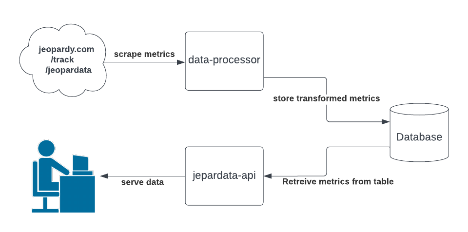
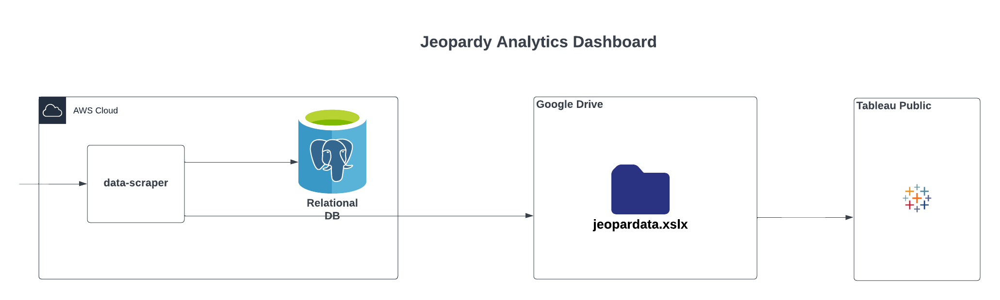

# jeopardy-data-scraper
Web scraper for parsing, transforming, and storing data from [Jeopary's Jeopardata webpage](https://www.jeopardy.com/track/jeopardata).
It also powers [this Tableau Public Dashboard](https://public.tableau.com/app/profile/george.dinicola/viz/JeopardyStatistics).

## Usage Modes
- Full data scrape and store
- Incremental data scrape and store

## Design Goals
- Provide an API and file export mechanisms for data analyst Jeopardy fans to easily explore Jeopardata
- Analyze and identify patterns in Jeopardy gameplay over time, such as presenting inflection points in data from influential players like James Holzhauer
- Provide a location to store historic Jeopardy! data in a transformed format more suitable for data-driven analysis and applications

## System Design

*Application scheduled to execute once per day after the Jeopardata posts to extract the most recent Jeopardy episode data it does not know of, then saves it to the DB.

## Data Persistence Layer
- Database Product: **PostgreSQL**
- Database Name: **jeaopardata**
- Table Name: **jeopardy_game_box_scores**
- Description: **The historical box scores for each game, player in each Jeopardy game.**

### Data Dictionary:
| Field Name                        | Data Type    | Description                                                      |
|-----------------------------------|--------------|------------------------------------------------------------------|
| EpisodeNumber                     | varchar(100) | The episode number of the Jeopardy game                          |
| EpisodeTitle                      | varchar(100) | The title of the Jeopardy episode                                |
| EpisodeDate                       | date         | The airing date of the Jeopardy episode                          |
| ContestantLastName                | varchar(100) | The last name of the contestant                                  |
| ContestantFirstName               | varchar(100) | The first name of the contestant                                 |
| HomeCity                          | varchar(100) | The home city of the contestant                                  |
| HomeState                         | varchar(100) | The home state of the contestant                                 |
| IsWinner                          | boolean      | Whether the contestant won the game                              |
| RoundOneAttempts                  | integer      | Number of attempts in round one                                  |
| RoundOneBuzzes                    | integer      | Number of buzzes in round one                                    |
| RoundOneBuzzPercent               | integer      | Percentage of buzzes in round one                                |
| RoundOneCorrectAnswers            | integer      | Number of correct answers in round one                           |
| RoundOneIncorrectAnswers          | integer      | Number of incorrect answers in round one                         |
| RoundOneCorrectAnswerPercent      | integer      | Percentage of correct answers in round one                       |
| RoundOneDailyDoubles              | integer      | Number of daily doubles in round one                             |
| RoundOneScore                     | integer      | Score at the end of round one                                    |
| RoundTwoAttempts                  | integer      | Number of attempts in round two                                  |
| RoundTwoBuzzes                    | integer      | Number of buzzes in round two                                    |
| RoundTwoBuzzPercent               | integer      | Percentage of buzzes in round two                                |
| RoundTwoCorrectAnswers            | integer      | Number of correct answers in round two                           |
| RoundTwoIncorrectAnswers          | integer      | Number of incorrect answers in round two                         |
| RoundTwoCorrectAnswerPercent      | integer      | Percentage of correct answers in round two                       |
| RoundTwoDailyDouble1              | integer      | First daily double found in round two                            |
| RoundTwoDailyDouble2              | integer      | Second daily double found in round two                           |
| RoundTwoScore                     | integer      | Score at the end of round two                                    |
| FinalJeopardyStartingScore        | integer      | Starting score for Final Jeopardy                                |
| FinalJeopardyWager                | integer      | Wager for Final Jeopardy                                         |
| FinalJeopardyScore                | integer      | Score after Final Jeopardy                                       |
| TotalGameAttempts                 | integer      | Total number of attempts throughout the game                     |
| TotalGameBuzzes                   | integer      | Total number of buzzes throughout the game                       |
| TotalGameBuzzPercent              | integer      | Total percentage of buzzes throughout the game                   |
| TotalGameCorrectAnswers           | integer      | Total number of correct answers throughout the game              |
| TotalGameIncorrectAnswers         | integer      | Total number of incorrect answers throughout the game            |
| TotalGameCorrectAnswerPercent     | integer      | Total percentage of correct answers throughout the game          |
| TotalGameDailyDoublesCorrect      | integer      | Number of daily doubles answered correctly throughout the game   |
| TotalGameDailyDoublesIncorrect    | integer      | Number of daily doubles answered incorrectly throughout the game |
| TotalGameDailyDoubleWinnings      | integer      | Total winnings from daily doubles throughout the game            |
| TotalGameScore                    | integer      | Total score at the end of the game                               |
| TotalTripleStumpers               | integer      | Total number of triple stumpers throughout the game              |

## Tableau Dashboard Project - Visualization of Jeopardy game data trends over time
### Project Link: [Tableau Public Dashboard](https://public.tableau.com/app/profile/george.dinicola/viz/JeopardyStatistics)
### Design: 

## API Endpoints
| Operation | Endpoint                           | Description |
|-----------|------------------------------------|-------------|
| GET       | `/v1/episodes`                     | Basic Information. Retrieves a list of episodes, optionally filtered by date range or specific attributes like episode number. **Params:**<ul><li>`startDate` (optional)</li><li>`endDate` (optional)</li><li>`episodeNumber` (optional)</li></ul> |
| GET       | `/v1/episodes/{episodeNumber}`     | Game Episode Information. Retrieves detailed information about a specific episode, including contestant details and scores. **Params:**<ul><li>`episodeNumber`</li></ul> |
| GET       | `/v1/episodes/{episodeNumber}/performance` | Game Episode Information. Retrieves information about contestants, potentially filtered by name, home city, or state. **Params:**<ul><li>`episodeNumber`</li><li>`gameWinner` - filters for game winners (i.e. game champion stats only)</li></ul> |
| GET       | `/v1/contestants`                  | Contestant Information. Retrieves information about contestants, potentially filtered by name, home city, or state. **Params:**<ul><li>`lastName` (optional)</li><li>`firstName` (optional)</li><li>`homeCity` (optional)</li><li>`homeState` (optional)</li></ul> |
| GET       | `/v1/export`                       | Data Export. Exports all of the data to the user's web browser. **Params:**<ul><li>`fileType` (default: csv)</li></ul>Supported data types: CSV, XLSX, JSON, Google Sheets |

## Algorithms for Scraping the Jeopardy Web Data
### Algorithm for Bulk Scrape
1. For each web page
2. Collect each episode by DATE
3. For each date
 &nbsp; &nbsp;4. Collect the names & home city info of the contestants
 &nbsp; &nbsp;5. Collect Jeopardy Round Data
 &nbsp; &nbsp;6. Collect Double Jeopardy  &nbsp; &nbsp;7. Collect Final Jeopardy Round Data
 &nbsp; &nbsp;8. Collect game totals data
 &nbsp; &nbsp; &nbsp; &nbsp; 9. write to DB

### Algorithm for Incremental Scrape
1. Check the last date in the DB
2. Collect data each episode by DATE from last date until current
3. For each date
 &nbsp; &nbsp;4. Collect the names & home city info of the contestants
5. Collect Jeopardy Round Data
6. Collect Double Jeopardy Roud Data
7. Collect Final Jeopardy Round Data
8. Collect game totals data
 &nbsp; &nbsp;9. write to DB